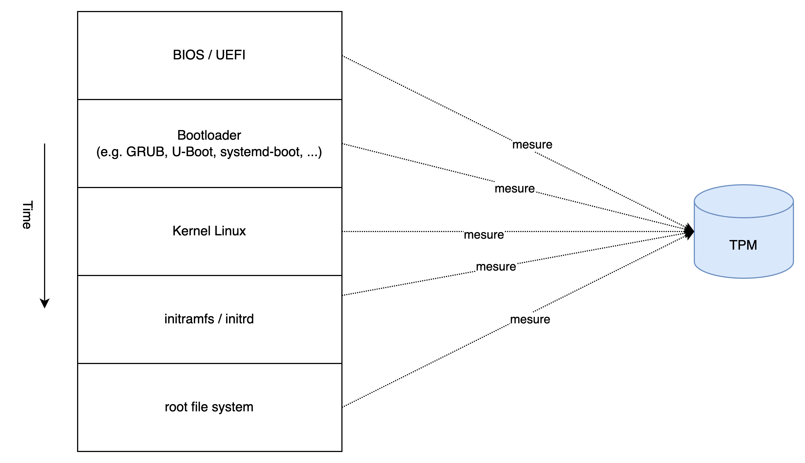
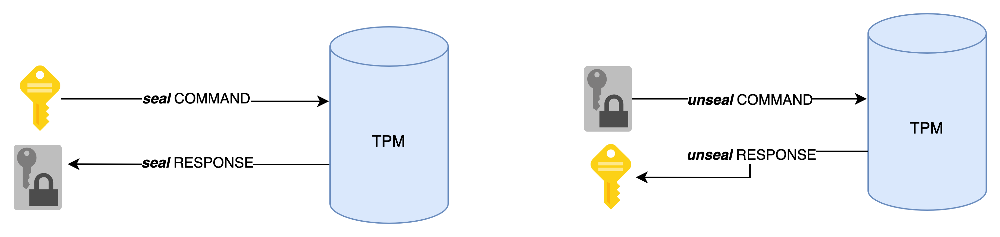

# Why TPM is super dope?

## Introduction

What is a TPM (Trusted Platform Module)? It's a secure cryptoprocessor — *a piece of hardware* — capable of performing cryptographic operations. Like a HSM[^1], a Smart Card[^2], or a YubiKey, a TPM must be considered as a **secure enclave** — a device able to create keys without allowing them to be exported, which is highly beneficial from a security perspective.

Where a TPM shines is in its ubiquity! Indeed, it can be found almost everywhere: PCs, servers, network gear, an increasing number of embedded systems, and even in the cloud. Therefore, it's very likely that you can already take advantage of it without spending a dime.

> For example, if you have developed the bad habit of storing your SSH key pairs in plaintext (i.e. *`~/.ssh/`*), be aware that you can generate them with a TPM to protect yourself from data theft if your *filesystem* is compromised.
>
> 

> <b>Tip</b>
>
> If you want to learn how: take a look at <a href="https://github.com/Foxboron/ssh-tpm-agent" target="_blank">ssh-tpm-agent</a> repo and its <a href="https://linderud.dev/blog/store-ssh-keys-inside-the-tpm-ssh-tpm-agent/" target="_blank">companion blog post</a>.
>

This functionality (highly important as it is) is actually just the tip of the iceberg. The TPM standard aims to address a *root of trust* issue through the principle of ***Hardware Root of Trust*** (HRoT). This standard operates on the premise that it is safer to base certain low-level functions on *hardware* rather than *software*.

For example, this concept can be applied during a machine's *boot* process, where measurements are transmitted to the TPM to verify its integrity[^3].

These measurements could be stored in memory or on the *filesystem*, but that would allow a *malware* to alter them. Conversely, the TPM is a standalone component [^4] dedicated to this task and incapable of executing code from external sources (e.g. malware).  

Similarly, a TPM solves the issue of storing a secret on disk. Historically, this problem was simply shifted, leading to the following situation: *« I will encrypt my secret with a symmetric key* 💡 *but where should I store this key?!* 🤯».  

Fortunately for us, the TPM elegantly solves this problem by providing the encryption key (which is not exportable).

This type of principle is used, for example, by [BitLocker](https://learn.microsoft.com/en-us/windows/security/operating-system-security/data-protection/bitlocker/) or systemd (i.e.  [systemd-cryptenroll](https://www.freedesktop.org/software/systemd/man/latest/systemd-cryptenroll.html)).  

It is even possible to combine these two concepts and ensure that the `unseal` mechanism is only allowed **if the machine is in a trusted state**, thanks to integrity measurements. We will explore this in more depth in the upcoming *pills*, but this already gives you a glimpse of the vast capabilities provided by a TPM.

<b>Who produced the TPM specification?</b>

The spec has been produced and is maintained by a consortium called <code class="hljs">Trusted Computing Group (TCG)</code>. 

TCG has also produced other specs that revolve around TPMs.

## Different kinds of TPM

***Note:** this section quotes content from [TPM 2.0: A Brief Introduction](https://trustedcomputinggroup.org/wp-content/uploads/TPM-2.0-A-Brief-Introduction.pdf) produced by TCG (Trusted Computing Group).*

You need to have in mind that there are different kinds of TPMs, each with its own security level and cost. The choice of a TPM will depend on the security level required by the system and the budget allocated to it:

- **Discrete TPM**: « *provides the highest level of security`[...]`. The intent of this level is to ensure that the device it’s protecting does not get hacked via even sophisticated methods. To accomplish this, a discrete chip is designed, built and evaluated for the highest level of security that can resist tampering with the chip, including probing it and freezing it with all sorts of sophisticated attacks.* »
- **Integrated TPM**: « *is the next level down in terms of security. This level still has a hardware TPM but it is integrated into a chip that provides functions other than security. The hardware implementation makes it resistant to software bugs, however, this level is not designed to be tamper-resistant.* »
- **Firmware TPM**: «  *is implemented in protected software. The code runs on the main CPU, so a separate chip is not required. While running like any other program, the code is in a protected execution environment called a trusted execution environment (TEE) that is separated from the rest of the programs that are running on the CPU. By doing this, secrets like private keys that might be needed by the TPM but should not be accessed by others can be kept in the TEE creating a more difficult path for hackers. In addition to the lack of tamper resistance, the downside to the TEE or firmware TPM is that now the TPM is dependent on many additional aspects to keep it secure, including the TEE operating system, bugs in the application code running in the TEE, etc.* »
- **Software TPM**: « *Software TPM can be implemented as a software emulator of the TPM. However, a software TPM is open to many vulnerabilities, not only tampering but also the bugs in any operating system running it. It does have key applications: it is very good for testing or building a system prototype with a TPM in it. For testing purposes, a software TPM could provide the right solution/approach.* »
- **Virtual TPM**: « *is part of the cloud-based environment and it provides the same commands that a physical TPM would but it provides those commands separately to each virtual machine.* »

| Trust Element | Security Level | Security Features | Relative cost | Use Case |
| ------------- | -------------- | ----------------- | :-----------: | -------- |
| Discrete TPM | Highest | Tamper resistant hardware | 💲💲💲 | Critical systems |
| Integrated TPM | Higher | Hardware | 💲💲 | e.g. Network gear |
| Firmware TPM | High | TEE | 💲  | Non-critical systems |
| Software TPM | N/A | N/A |   Free   | Testing and prototyping |
| Virtual TPM | High | Hypervisor | Cheap  | Cloud environment |

<b>Table: </b><em>TPM classification</em>

## Conclusion

In this brief introduction, my goal was to present the key features that make the TPM an essential component for establishing a paradigm focused on security. It is also in this spirit that Microsoft requires a **TPM 2.0** to install Windows 11[^5] [^6] on a machine.

<b>Important</b>

Up until now, this is the first time I mention <code class="hljs">TPM 2.0</code>. <code class="hljs">TPM 2.0</code> is simply the version that follows <code class="hljs">TPM 1.2</code>. Just consider that the second iteration was designed to address several issues and that it is now <em>de facto</em> the industry standard.

<b><em>note: every time I use the term TPM, I always refer to TPM 2.0</em></b>.

If you're interested in the differences between <code class="hljs">TPM 1.2</code> and <code class="hljs">TPM 2.0</code>, I recommend you to read this <a href="https://learn.microsoft.com/en-us/windows/security/hardware-security/tpm/tpm-recommendations#tpm-12-vs-20-comparison" target="_blank">documentation</a> provided by Microsoft.

Please note that in this first *pill*, I haven't mentioned all the features offered by a TPM (e.g., authorization system, auditing, etc.). However, those I believe important will be covered in next *pills*.

For the sake of impartiality, I must highlight the drawbacks inherent in using a TPM:

* Resources are limited (storage, memory)
* Cryptographic operations (e.g., key generation, signatures, encryption) are much slower than on other devices (due to the previous point)
* You have to be aware of many concepts to use or administrate TPMs properly - but don't worry, `TPM pills` will guide you through them!

### What's about Apple devices?

Contrary to Microsoft and Linux, Apple made the decision to use a proprietary solution called [Secure Enclave](https://support.apple.com/guide/security/sec59b0b31ff/web).

<b>Tip</b>

If you are a macOS user, you can still stay with us because most of the exemples will use a Software TPM which you will be able to run on your machine.

## Next pill...

...we will setup a minimal environment to interact with a TPM in your running system.

---

🚧 `TPM Pills` is in **beta** 🚧

* if you encounter problems 🙏 please report them on the [tpm-pills](https://github.com/loicsikidi/tpm-pills/issues) issue tracker
* if you think that `TPM Pills` should cover a specific topic which isn't in the [roadmap](https://github.com/loicsikidi/tpm-pills/blob/main/ROADMAP.md), let's initiate a [discussion](https://github.com/loicsikidi/tpm-pills/discussions/new?category=ideas) 💬

[^1]: Hardware Security Module (see more in [Wikipedia](https://en.wikipedia.org/wiki/Hardware_security_module))
[^2]: see more in [Wikipedia](https://en.wikipedia.org/wiki/Smart_card)
[^3]: via a `Secure Boot` or a `Mesured Boot`.
[^4]: it has its own memory (RAM) and its own storage, although the resources are very limited.
[^5]: [Window 11 - System requirements](https://www.microsoft.com/en-us/windows/windows-11-specifications?r=1#table1)
[^6]: This decision by a tech giant led to a drop in TPM prices.
