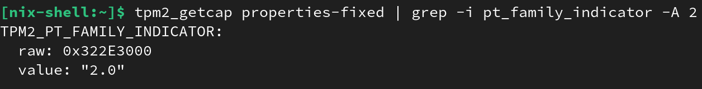

# Install tooling in Your Running System

The goal here is to prepare your environment to run the examples provided in `TPM Pills`, if (like me) you only trust what you see with your own eyes. **It's not a requirement**. Indeed, you can limit yourself to read the content and code snippets. However, I strongly recommend you to read and run the examples to better understand the concepts.

## Disclaimer regarding Windows  

So far, my experience with TPMs has been exclusively limited to a **Linux** context — this is why, I am open to <a href="https://github.com/loicsikidi/tpm-pills/issues" target="_blank">feedback</a> from Windows users, if they encounter any issues.  

<div class="warning">
<b>Warning</b>

Unfortunately, according to <a href="https://github.com/microsoft/WSL/issues/5178" target="_blank">this issue</a>, TPM is not added to WSL (<em>Windows Subsystem for Linux</em>), so it will be necessary to run commands from the host machine.
</div>

## Prerequisites  

`TPM Pills` will require you to have the following tools (in addition to `git`):  

| Tool | Description | Linux Support | Windows Support | MacOS Support |  
| ---- | ----------- | :-----------: | :-------------: | :-----------: |  
|  **<a href="https://go.dev/" target="_blank">go</a>** >= `v1.22` | A language that no longer needs an introduction | ✅ | ✅ | ✅ |
|  **<a href="https://github.com/openssl/openssl" target="_blank">openssl</a>** | Crypto *Swiss Army Knife* which here is a dependency for using the Software TPM | ✅ | ✅ | ✅ |
|  **<a href="https://github.com/stefanberger/swtpm" target="_blank">swtpm</a>** | A Software TPM Emulator | ✅ |  ✅ <br><br> (<a href="https://github.com/stefanberger/swtpm/wiki#compile-and-install-on-cygwin" target="_blank">using Cygwin</a>) |  ✅ |
|  **<a href="https://github.com/tpm2-software/tpm2-tools" target="_blank">tpm2-tools</a>** | A CLI (*Command-Line Interface*) for interacting with a TPM | ✅ | ❌ | ❌ |  

<p align="center"><b>Table: </b><em>Tooling support per Operating System</em></p>

`tpm2-tools` is a great tool to have in your *toolbox*! However, since it is not available everywhere, it will be used sparingly.  

> *Note: `PowerShell` provides some <a href="https://learn.microsoft.com/en-us/powershell/module/trustedplatformmodule" target="_blank">commands</a> to interact with a TPM, but they will not be covered here.* 

### Why `go`?  

Most educational content on the subject is in **C**... but why follow the crowd, right?!

More seriously:  

* I am not an experienced **C** developer, but I am proficient in **Go**
* <a href="https://github.com/google/go-tpm" target="_blank">`go-tpm`</a> provides a rich interface for communicating with a TPM
* In the upcoming *pills*, we will make the TPM interact with a server in gRPC, and **Go** allows me to do this easily
* More and more projects in Golang ecosystem use TPMs (e.g., <a href="https://github.com/spiffe/spire" target="_blank">spire</a>, <a href="https://github.com/facebookincubator/sks" target="_blank">sks</a>, <a href="https://github.com/u-root/u-root" target="_blank">u-root</a>, <a href="https://github.com/edgelesssys/constellation" target="_blank">constellation</a>, etc.)

Fundamentally, since the `TPM 2.0` interface is a standard, all the concepts we will cover here are also applicable in other languages.  

#### TPM 2.0 Clients  

For those interested, here is a (probably non-exhaustive) list of TPM 2.0 clients.  

| Name | Language | Description |
| ---- | -------- | ----------- |
| <a href="https://github.com/tpm2-software/tpm2-tss" target="_blank">tpm2-tss</a> | C | Intel implementation of TCG's TPM Software Stack (TSS). The current standard meter bar regarding TPM libraries. |
| <a href="https://github.com/kgoldman/ibmtss" target="_blank">ibmtss</a> | C | IBM implementation of TPM Software Stack (TSS) but not API compatible with TCG TSS. |
| <a href="https://github.com/wolfSSL/wolfTPM" target="_blank">wolfTPM</a> | C | TPM 2.0 librairy designed for embedded system. |
| <a href="https://github.com/google/go-tpm" target="_blank">go-tpm</a> | golang | |
| <a href="https://github.com/tpm2-software/tpm2-pytss" target="_blank">tpm2-pytss</a> | python | Wrapper of `tpm2-tss`. |
| <a href="https://github.com/tpm-rs/tpm-rs" target="_blank">tpm-rs</a>| rust | |
| <a href="https://github.com/tpm2-software/rust-tss-fapi" target="_blank">rust-tss-fapi</a>| rust | Wrapper of `libtss2-fapi` which is an upper API provided by `tpm2-tss` named FAPI[^1]. <br><br>***Warning**: project's maintainers underline that the implementation is experimental and shouldn't be use in production*. |
| <a href="https://github.com/microsoft/TSS.MSR" target="_blank">TSS.MSR</a>| c#, c++, java, nodejs and python | |

<p align="center"><b>Table: </b><em>TPM libraries</em></p>

## Installation  

### OCI

🚧 TBD 🚧

### Nix  

If you are a Nix user, `TPM Pills` provides a Nix shell (i.e. `shell.nix`) at the root of the repository.  

To install dependencies, simply run the following commands:

```bash
git clone https://github.com/loicsikidi/tpm-pills.git
cd ./tpm-pills
# launch the derministic shell
nix-shell

# inside the shell
go version
tpm2 --version
```

> *Note: with this method `tpm2-tools` will only be installed on a Linux platform.*

### Devbox

<div class="info">
<b>Info</b>

 For those who are unfamiliar, <a href="https://github.com/jetify-com/devbox" target="_blank">Devbox</a> is a layer on top of <b>Nix</b> that allows you to obtain a deterministic shell without having to master the Nix language.
</div>

If you are a Devbox user, `TPM Pills` also provides a configuration (i.e. `devbox.json`) at the root of the repository.

To install dependencies, simply run the following commands:

```bash
git clone https://github.com/loicsikidi/tpm-pills.git
cd ./tpm-pills
# launch the derministic shell
devbox shell

# inside the shell
go version
tpm2 --version
```

> *Note: with this method `tpm2-tools` will only be installed on a Linux platform.*

### Manually

* **go**: Use your preferred *package manager* or download the binary from the <a href="https://go.dev/doc/install" target="_blank">official website</a>
* **openssl**: Use your preferred *package manager* or get the sources from the <a href="https://openssl-library.org/source/" target="_blank">official website</a>
* **swtpm**: Use your preferred package manager or build the sources by following the <a href="https://github.com/stefanberger/swtpm/wiki" target="_blank">official documentation</a>
* **tpm2-tools**: Use your preferred *package manager* or build the sources by following the <a href="https://tpm2-tools.readthedocs.io/en/latest/INSTALL/" target="_blank">official documentation</a>

## Example: validate TPM's version

Let's finally get to the serious stuff! We will check the version of the TPM installed on your machine and ensure that it is a `TPM 2.0`. We will be able to do this by interacting directly with the TPM using a command called `TPM2_GetCapability`.

<div class="info">
<b>Info</b>

On Linux, access to the Hardware TPM is secured by <b>sudo</b> rights. It is possible to have finer control using a <code class="hljs">udev</code> policy to allow specific users or groups to access it (e.g., the policy available in <a href="https://github.com/NixOS/nixpkgs/blob/88a55dffa4d44d294c74c298daf75824dc0aafb5/nixos/modules/security/tpm2.nix#L10-L21" target="_blank">NixOS</a>).
</div>

### tpm2-tools  

<div class="warning">
<b>Warning</b>

<em>Only works on Linux.</em>
</div>

```bash
# dependending on your config it might require 'sudo'
tpm2_getcap properties-fixed | grep -i pt_family_indicator -A 2
```

You should get the following output:  



### go  

The script will works on all environments (on `Darwin`, the code relies on a Software TPM).

Run the following command:

```bash
# dependending on your config it might require 'sudo'
go run github.com/loicsikidi/tpm-pills/examples/02-pill

# output:
# TPM Version: 2.0
```

Depending on your local setup, you can also run the following command:

```bash
# nix command
nix-shell --run "go run github.com/loicsikidi/tpm-pills/examples/02-pill"
# devox command
devbox run -- go run github.com/loicsikidi/tpm-pills/examples/02-pill
```

## Next pill...

...we will see in much more details how we can interact with a TPM.

---

🚧 `TPM Pills` is in **beta** 🚧

* if you encounter problems 🙏 please report them on the <a href="https://github.com/loicsikidi/tpm-pills/issues" target="_blank">tpm-pills</a> issue tracker
* if you think that `TPM Pills` should cover a specific topic which isn't in the <a href="https://github.com/loicsikidi/tpm-pills/blob/main/ROADMAP.md" target="_blank">roadmap</a>, let's initiate a <a href="https://github.com/loicsikidi/tpm-pills/discussions/new?category=ideas" target="_blank">discussion</a> 💬

[^1]: Feature API
