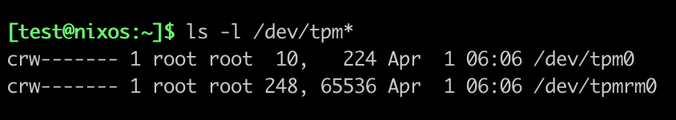
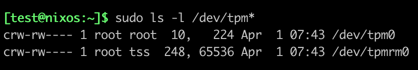

# How to interact with a TPM?

## Introduction

It’s important to keep in mind that a TPM is primarily a **passive** device. By *“passive”*, I mean that a TPM will never act on its own—it always responds to a request. This behavior could be compared to a *REST API*, for example. The specification[^1] defines a set of commands (a little over a hundred) that a TPM must support, along with the associated interface contract.

In the <a href="02-install-tooling.html#example-validate-tpms-version" target="_blank">previous pill</a>, we used the `TPM2_GetCapability` command to display the TPM version. This command is very useful because it provides a set of information about a TPM (static data) and its current state (dynamic data). The two libraries (*tpm2-tools and go-tpm*) that we used did more or less the same thing:

1. The library created the `TPM2_GetCapability` command in accordance with the specification  
1. The command was sent to the TPM[^2]
1. The command was received and interpreted by the TPM  
1. The TPM produced a response in accordance with the specification  
1. The response was sent back to the client[^2]

## Local Access

<b>Important</b>

The content below focuses on Linux.

Let’s take a closer look at the transmission part (steps 2 and 5), as this is a topic that’s often overlooked. The diagram above describes a somewhat simplistic interaction. In reality, a TPM client never has a direct connection to a TPM, which, let’s remember, is a physical device. It's the operating system that provides an interface to bridge the *userspace* and the *hardware*.

<b>Info</b>

The device is usually named <code class="hljs">/dev/tpm0</code>.

As we saw in <a href="01-why-tpm-is-super-dope.html" target="_blank">pill #1</a>, a TPM is characterized by being resource-efficient, which is why it does not natively manage *multi-tenancy* when several applications need to communicate concurrently with it. To address this issue, the TCG produced a specification (*<a href="https://trustedcomputinggroup.org/resource/tss-tab-and-resource-manager/" target="_blank">TCG TSS 2.0 TAB and Resource Manager</a>*) describing how to implement this logic.

<b>Info</b>

<a href="https://github.com/tpm2-software/tpm2-abrmd" target="_blank"><code class="hljs">tpm2-abrmd</code></a> is an implementation of that spec.

Adding this functionality unfortunately requires installing an additional tool on your machine and maintaining it in an operational state. Fortunately for us, starting from kernel version 4.12[^3], the *Resource Manager* is a service directly integrated into the OS—which greatly simplifies integration. In summary, if your application communicates with a TPM, it will generally follow the pattern below:

<b>Info</b>

As you’ve noticed, the OS provides a new device named <code class="hljs">/dev/tpmrm0</code>. It is preferable to use it to take advantage of the features offered by the <em>Resource Manager</em>.

By default, the data flow is unencrypted; however, we’ll see in a dedicated pill how it is possible to encrypt it.

### Limitations

In most distributions, the *devices* dedicated to the TPM are owned by the `root` user.

<em>Screenshot from a NixOS Laptop</em>

This has significant implications, as it requires your application to be run with *root* privileges—an unacceptable situation in many contexts (e.g., general public usage). By comparison, a Yubikey will ask the user to enter a PIN or press the device to unlock access to keys, without the underlying driver requiring `root` privileges. The concept of authorization exists on a TPM, so there's fundamentally nothing preventing a *rootless* approach.

Unfortunately, there is no consensus on the subject that would allow all applications to communicate with a TPM in a *rootless* manner. As of now, the ***hack*** consists of requiring the user to install <a href="https://github.com/tpm2-software/tpm2-tss" target="_blank">`tpm2-tss`</a> in order to benefit from its <a href="https://github.com/tpm2-software/tpm2-tss/blob/b6fd5147a0618019af0d1d6d597492014354da3b/dist/tpm-udev.rules" target="_blank">*udev rules*</a>, which have become a sort of unofficial standard. Admittedly, this method is not ideal, for two reasons:

1. It installs a binary that might not even be used  
2. `tpm2-tss` is not necessarily packaged on all distributions  

Nevertheless, it allows you to achieve the following result:

<em>Screenshot from a NixOS Laptop</em>

> *Note: in the different labs, we won’t be affected by this issue, as we’ll be using a Software TPM.*

### What about Windows?

Since Windows 8 and Windows Server 2012, the operating system includes TBS (*TPM Base Services*), which is an interface that centralizes access to the TPM through RPC calls[^4]. The following illustration shows the relationship between TBS and the TPM:

<em>source: https://learn.microsoft.com/en-us/windows/win32/devio/tpm-base-services</em>

<b>Info</b>

For security reasons, TBS only accepts calls originating from the host machine.

## Remote Access

We’ve seen how to interact with a TPM locally, but is it possible to do so remotely? The answer is **yes**. `tpm2-tss` implements a number of *drivers*[^5] that enable remote access. There are two approaches—either via SSH access or via a TCP socket.

As an example, the TCP approach is the one used by many simulators such as:

* <a href="https://github.com/stefanberger/libtpms" target="_blank">libtpms</a>
* <a href="https://github.com/stefanberger/swtpm" target="_blank">swtpm</a>
* <a href="https://github.com/microsoft/ms-tpm-20-ref" target="_blank">mssim</a>

The most important thing is to remember that this type of access exists. If your context requires it, keep in mind that establishing an encrypted channel is a prerequisite to prevent any *man-in-the-middle* attacks.

## Bonus: an exotic TPM

It's worth knowing that a TPM can also be located outside of a machine, for example... on a USB stick! That's the rather wild idea proposed by <a href="https://hackaday.io/project/193028-letstrust-tpm2go/details" target="_blank">LetsTrust-TPM2Go</a>, offering a portable TPM.

Technically, this is a TPM that responds to SPI (Serial Peripheral Interface) inputs; then, *libusb* is used to connect the USB device with the host.

*source: <a href="https://github.com/tpm2-software/tpm2-tss/blob/master/doc/tcti.md#tcti-spi-ltt2go" target="_blank">https://github.com/tpm2-software/tpm2-tss/blob/master/doc/tcti.md#tcti-spi-ltt2go</a>*

## Acknowledgement

This pill is derived from Trusted Computing 1101: Introductory Trusted Platform Module (TPM) usage class, available at <a href="https://ost2.fyi/TC1101" target="_blank">https://ost2.fyi/TC1101</a>.

<b>Info</b>

To be precise, the term "passive device" was taken from this content (which I recommend), the rest is original.

## Conclusion

In this pill, we’ve seen how we can interact with a TPM and, most importantly, the wide range of methods available to us—whether for local or remote access.

## Next pill...

...we will create our first key and discover how the TPM manages such resources.

---

🚧 `TPM Pills` is in **beta** 🚧

* if you encounter problems 🙏 please report them on the <a href="https://github.com/loicsikidi/tpm-pills/issues" target="_blank">tpm-pills</a> issue tracker
* if you think that `TPM Pills` should cover a specific topic which isn't in the <a href="https://github.com/loicsikidi/tpm-pills/blob/main/ROADMAP.md" target="_blank">roadmap</a>, let's initiate a <a href="https://github.com/loicsikidi/tpm-pills/discussions/new?category=ideas" target="_blank">discussion</a> 💬

[^1]:  more precisely in <a href="https://trustedcomputinggroup.org/wp-content/uploads/Trusted-Platform-Module-2.0-Library-Part-3-Version-184_pub.pdf" target="_blank">Part 3: Commands</a>
[^2]: <a href="https://trustedcomputinggroup.org/wp-content/uploads/Trusted-Platform-Module-2.0-Library-Part-3-Version-184_pub.pdf#page=313" target="_blank">here</a> in the spec
[^3]: released on July 2, 2017
[^4]: Remote Procedure Call
[^5]: these *"drivers"* are an implementation of the TPM Command Transmission Interface (TCTI). Please refer to this <a href="https://github.com/tpm2-software/tpm2-tss/blob/master/doc/tcti.md#tcti-cmd" target="_blank">document</a> for more information.
