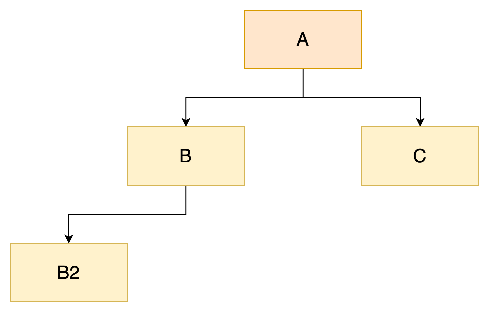
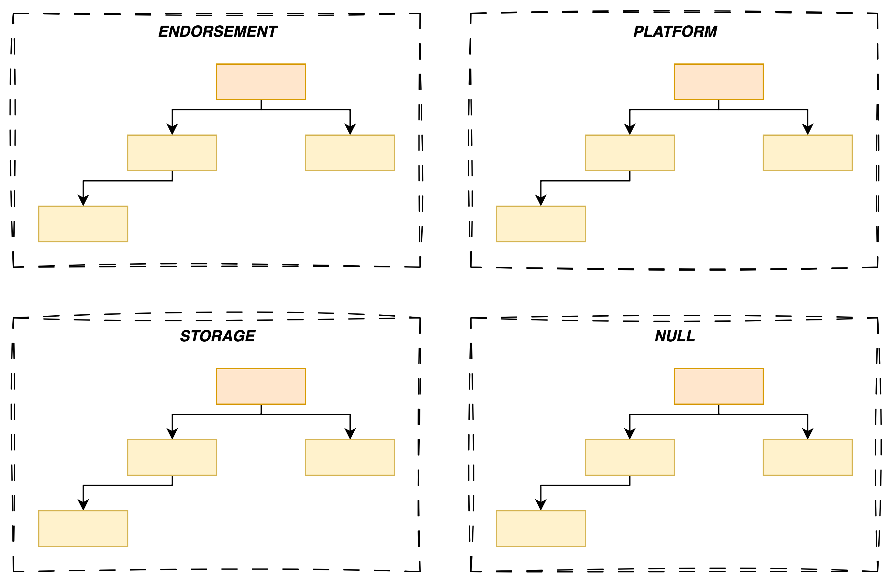
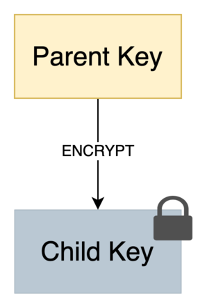

# Create a TPM key

Let’s start by introducing few concepts before getting our hands dirty.

## Concepts

### Key Hierarchy

A TPM manages its keys in a rather unique way by applying the principle of **hierarchy**.

Let's analyze the diagram below to better understand this concept:



The diagram represents a tree with the following relationships:

* `A` is the parent of `B` and `C`
* `B` is the parent of `B2`

This model directly maps to how a TPM organizes its keys, which are divided into **two types**:

1. **Primary key**: a resource with no parent (e.g., `A`)
2. **Ordinary key**: a resource that has a parent (e.g., `B`, `B2`, and `C`)

> *Notes:*
>
> * *A key has only one parent*
> * *An ordinary key can itself be the parent of another key (e.g., `B`)*
> * *A key can have multiple children (e.g., `A`)* 

This parent/child distinction explains why two separate commands exist for key creation:

* `TPM2_CreatePrimary`: creates a primary key
* `TPM2_Create`: creates an ordinary key (which requires a reference to a parent key)

Moreover, all keys belong to a specific *tenant* referred to as a **hierarchy** in the TPM specification[^1] which I admit can be confusing. Each `TPM 2.0` implementation provides exactly four fixed *tenants/hierarchies*, which can be disabled if needed[^2]. 

*What is the rationale behind this design?*

The spec assumes a TPM may be used in different contexts, so fine-grained access control is needed to support multiple roles. Each hierarchy has its own independent authorization scheme[^2].

Below is a full list of hierarchies:

| Name | Purpose | Type |
| ---- | ------- | ---- |
| Storage or Owner hierarchy | Intended for non-privacy-sensitive operations by the platform owner (e.g., an IT department, the end user).  | Persisted | 
| Platform hierarchy | Intended to be under the control of the platform manufacturer[^3] for early boot tasks (e.g., BIOS, UEFI). In other words, it's not meant to be used by the end user. | Persisted |
| Endorsement hierarchy | Intended for privacy-sensitive operations when the user or an organization has privacy concerns.  | Persisted |
| Null hierarchy | Intended to store ephemeral objects (e.g. sessions, context, etc.) used internally by the TPM. The end user can use this hierarchy to use ephemeral keys that will be erased at reboot. | Volatile |

<p align="center"><b>Table: </b><em>Four TPM hierarchies</em></p>

<div class="info">
<b>What does "privacy" means in the TPM specification?</b>

<code class="hljs">Privacy</code> refers to mechanisms which prevent a third party from correlating or identifying that multiple keys originate from the same TPM.

<em>Note: in a enterprise context, the opposite may be desirable for auditing and control purposes.</em>
</div>

The diagram below summarizes the key ideas we've just covered:



<div class="info">
<b>Info</b>

Most of the time, you will only use the <code class="hljs">Storage</code> and <code class="hljs">Endorsement</code> hierarchies.

Exceptionally, you may need to use the <code class="hljs">Null</code> hierarchy if <em>ephemerality</em> is a requirement.
</div>

### Reproducibility

Reproducibility is a **fundamental primitive** in a TPM. Indeed, the latter can regenerate a Primary Key **bit-for-bit**, eliminating the need for backups — at least for this kind of keys.

*How does this work?*

Each hierarchy is tied to a **seed**[^4], a complex string of characters generated randomly by the TPM and never exportable. When creating a key, the client provides *inputs* that describe the key’s desired characteristics. The TPM then derives the actual key using a Key Derivation Function (KDF)[^5], with two parameters: the inputs and the seed.

We can express this as the following equation:

\\( KDF(inputsX, seedY) = keyXY \\)

Since the *seed* is typically stable, the TPM can deterministically reproduce the key whenever needed.

> *Note: given the high entropy of seeds, it’s extremely unlikely that two TPMs will generate the same key.*

#### Persisted vs. Volatile Hierarchies

Earlier, we distinguished between persisted and volatile hierarchies. Now that the *seed* concept has been introduced, we can clarify this:

* A **persisted hierarchy** maintains the same seed across reboots.
* A **volatile hierarchy**, by contrast, generates a new seed on every reboot, making its keys ephemeral.

<div class="warning">
<b>Warning</b>

With sufficient privileges, it's possible to force a seed rotation for any persisted hierarchy — but this will invalidate all previously created keys.

Use this operation with caution.
</div>

### Key Attributes

When creating a key, you define its properties through a set of attributes.

Here’s a non-exhaustive list of possible attributes:

| Name | Description | 
| --- | ----------- |
| `sign` | The key can sign data |
| `decrypt` | The key can decrypt data (it previously encrypted) |
| `restricted` | The key can sign or encrypt internal TPM data |
| `fixedTPM` | The key cannot be duplicated |
| `fixedParent` | The key cannot be duplicated to another parent |
| `sensitiveDataOrigin` | The key was generated by the TPM itself[^6] |

<p align="center"><b>Table: </b><em>Key Attributes</em></p>

<div class="info">
<b>Info</b>

A complete list is available <a href="https://trustedcomputinggroup.org/wp-content/uploads/Trusted-Platform-Module-2.0-Library-Part-1-Version-184_pub.pdf#page=181" target="_blank">here</a>.
</div>

Typically, you will combine these attributes based on your use case.

#### Example: A Parent Key

As mentioned above in the [key hierarchy](#key-hierarchy) section, a key can act as a parent to others. The TPM spec mandates that such a key conforms to the following pattern:

| sign | decrypt | restricted |
| :--: | :-----: | :--------: |
|  0   |    1    |      1     |

*Why?*

A TPM has limited storage. To manage keys securely outside the TPM (e.g., on disk), the parent key must be able to encrypt the private portion (i.e. `TPM2B_PRIVATE`) of its children.

<p></p>

Later, when the private key is loaded into the TPM, the parent key decrypts the blob. Since `TPM2B_PRIVATE` is treated as an internal TPM resource, the key must have the *restricted* attribute.

<div class="info">
<b>Info</b>

In the spec, this kind of key is also called a <em>Storage Parent</em>.
</div>

## A Practical Example

Now that we’ve covered the main ideas, let’s get hands-on!

<div class="warning">
<b>Goals</b> </br>

1. Create an ECC NIST P256 ordinary key (requires creating a primary key first)
2. Store the key on the filesystem
3. Load the key into the TPM
</div>

### Creating the Primary Key

We start by creating the root key in the hierarchy. It **MUST** have both `restricted` and `decrypt` attributes set to `TRUE` to be considered a *Storage Key*. We provide this information to the `TPM2_CreatePrimary` command as shown in the snippet below:

```go
// without error handling for more clarity
createPrimaryCmd := tpm2.CreatePrimary{
	PrimaryHandle: tpm2.TPMRHOwner, // indicates in which hierarchy the key must belong (Owner == Storage)
	InPublic:      tpm2.New2B(tpm2.TPMTPublic{
		Type:    tpm2.TPMAlgECC, // type of key 
		NameAlg: tpm2.TPMAlgSHA256,
		ObjectAttributes: tpm2.TPMAObject{
			FixedTPM:            true,
			FixedParent:         true,
			SensitiveDataOrigin: true, // indicates that the key must be produced by the TPM
			UserWithAuth:        true,
			// required attributes to get a storage key ⬇️
			Restricted:          true, 
			Decrypt:             true,
			SignEncrypt          false, 
		},
		Parameters: ... // truncated
	})
}
createPrimaryRsp, _ := createPrimaryCmd.Execute(tpm)
```

### Creating the Ordinary Key

With the *Storage Key* created, we now have everything we need to create an ordinary key using the `TPM2_Create` command.

```go
// without error handling for more clarity
createRsp, _ := tpm2.Create{
	ParentHandle: tpm2.NamedHandle{ // indicates a reference to the parent (i.e. storage key)
		Name:   createPrimaryRsp.Name,
		Handle: createPrimaryRsp.ObjectHandle,
	},
	InPublic: template,
}.Execute(tpm)
```

`TPM2_Create`'s response contains the following fields:

| Type | Name | Description |
| ---- | ---- | ----------- |
| **TPM2B_PRIVATE** | **outPrivate** |  **the private portion of the object** |
| **TPM2B_PUBLIC** | **outPublic** | **the public portion of the created object** |
|TPM2B_CREATION_DATA | creationData | contains a TPMS_CREATION_DATA |
| TPM2B_DIGEST | creationHash | digest of creationData.creationData using
nameAlg of outPublic |
| TPMT_TK_CREATION | creationTicket | ticket used by TPM2_CertifyCreation() to validate
that the creation data was produced by the TPM |

<p align="center"><b>Table: </b><em>TPM2_Create Response</em></p>

The result contains two important fields: `outPrivate` and `outPublic`, which can safely be stored on disk because:

* `TPM2B_PUBLIC` is meant to be public
* `TPM2B_PRIVATE` is opaque (because encrypted by the parent key)

<div class="info">
<b>Info</b>

Due to the TPM's limited resources, keys are typically stored externally.
</div>


### Loading the Ordinary Key

To load a key into the TPM, we need to use `TPM2_Load` command along with `TPM2B_PUBLIC` and `TPM2B_PRIVATE` data.

```go
// without error handling for more clarity
loadRsp, _ := tpm2.Load{
	ParentHandle: tpm2.NamedHandle{ // reference to the parent key
		Name:   createPrimaryRsp.Name,
		Handle: createPrimaryRsp.ObjectHandle,
	},
	InPublic:  public, // TPM2B_PUBLIC
	InPrivate: private, // TPM2B_PRIVATE
}.Execute(tpm)
```

Once loaded, the key can be used to perform cryptographic operations, depending on its attributes.

### Complete Example

To make this more concrete, this pill includes a working example that implements everything we’ve discussed so far.

<div class="info">
<b>Info</b>

The source code is available <a href="https://github.com/loicsikidi/tpm-pills/tree/main/examples/04-pill" target="_blank">here</a>.
</div>


It provides a CLI for creating and loading an ordinary key into a TPM.

Depending on your setup, you can run the following terminal commands:

```bash
# Create the key
# Note: the key will be stored in the current directory with the name `tpmkey.pub` and `tpmkey.priv`
go run github.com/loicsikidi/tpm-pills/examples/04-pill create
# output: Ordinary key created successfully 🚀

# list created files
ls -l tpmkey.*

# OPTIONAL: use tpm2-tools to print public object
tpm2 print -t TPM2B_PUBLIC ./tpmkey.pub

# Load the key in the TPM
go run github.com/loicsikidi/tpm-pills/examples/04-pill load --public ./tpmkey.pub \
--private ./tpmkey.priv
# output: Ordinary key loaded successfully 🚀

# Clean up
# Note: the command will remove swtpm state
go run github.com/loicsikidi/tpm-pills/examples/04-pill cleanup
# output: State cleaned successfully 🚀

# remove created files
rm ./tpmkey.pub ./tpmkey.priv
```

> *Note: by default, the example uses [swtpm](https://github.com/stefanberger/swtpm) as a TPM simulator. If you want to use a real TPM, you can specify the `--use-real-tpm` flag.*

<div class="info">
<b>Why isn’t the primary key exported?</b>

The output of  <code class="hljs">TPM2_CreatePrimary</code> doesn’t include a <code class="hljs">TPM2B_PRIVATE</code>, which prevents loading it later via  <code class="hljs">TPM2_Load</code>. 

This is by design: a primary key is <b>reproducible</b>.
</div>

### Bonus

The file [04-pill/concepts_test.go](https://github.com/loicsikidi/tpm-pills/tree/main/examples/04-pill/concepts_test.go) includes unit tests that demonstrate key concepts from this pill, including **key reproducibility** and that **only storage keys can have children**.

Feel free to check it out if you’re curious.

## Conclusion

In this pill, we introduced key concepts in TPM key management.

In summary, we covered:

* The idea of hierarchies
* The difference between primary and ordinary keys
* The reproducible nature of primary keys
* Key attributes and their purposes

Then, we applied these ideas in a practical example.

## Next pill...

...we’ll use TPM keys to perform cryptographic operations.

---

🚧 `TPM Pills` is in **beta** 🚧

* if you encounter problems 🙏 please report them on the [tpm-pills](https://github.com/loicsikidi/tpm-pills/issues) issue tracker
* if you think that `TPM Pills` should cover a specific topic which isn't in the [roadmap](https://github.com/loicsikidi/tpm-pills/blob/main/ROADMAP.md), let's initiate a [discussion](https://github.com/loicsikidi/tpm-pills/discussions/new?category=ideas) 💬

[^1]: if you're familiar with the PKCS#11 protocol, a hierarchy is similar to the concept of a  `token`
[^2]: with the exception of the NULL hierarchy
[^3]: this refers to the OEM (Original Equipment Manufacturer)
[^4]: also referred to as the *primary seed*
[^5]: see the Wikipedia [article](https://en.wikipedia.org/wiki/Key_derivation_function)
[^6]: it may have been generated elsewhere and then imported into the TPM
