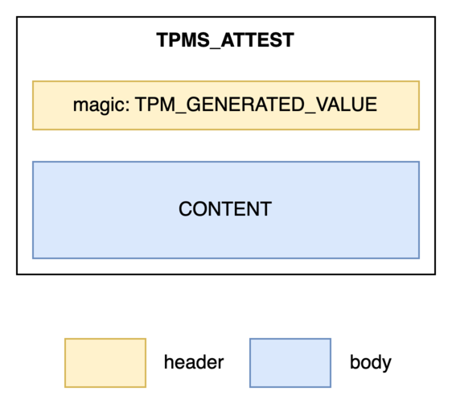
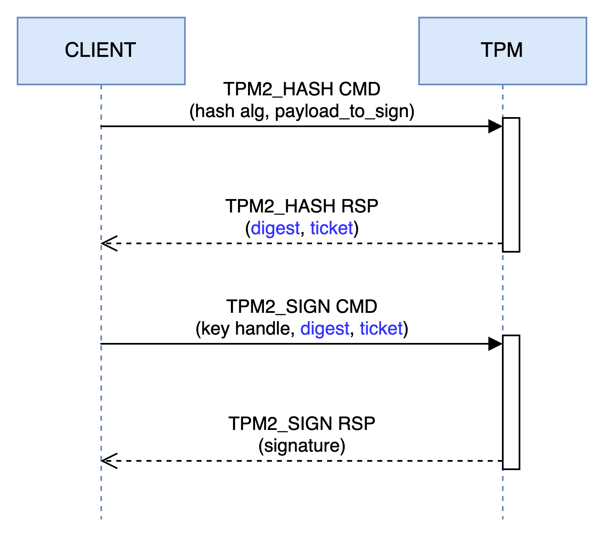

# Perform cryptographic operations with asymmetric keys

<div class="info">
<strong>Foreword</strong>

As the title suggests, in this pill we will focus on asymmetric keys; however, note that the next pill will be dedicated to the use of symmetric keys.
</div>

A TPM is capable of performing basic cryptographic operations such as encryption/decryption and signing/verification. To use these methods, keep in mind that the key must first be loaded (i.e., `TPM2_Load`).

<div class="info">
<strong>Info</strong>

The code of the CLI  that you will see below is fully available <a href="https://github.com/loicsikidi/tpm-pills/tree/main/examples/05-pill" target="_blank">here</a>.

> Note: if you want to use a real TPM in the examples, you can add `--use-real-tpm` flag in `go run github.com/loicsikidi/tpm-pills/examples/05-pill create` command.
</div>

## Encryption / Decryption

Let’s begin with *encryption + decryption* using an asymmetric key. This function ensures data integrity and confidentiality and follows this pattern:

1. The public key encrypts a payload
2. The private key decrypts the payload

However, asymmetric encryption has a limitation: **maximum payload size**. For example, here are the constraints when using an RSA key with OAEP padding[^1]:

| Algorithm | Parameters | Maximum message length <br>(in bytes) |
| --------- | :--------: | :-------------------------------: |
| RSA_DECRYPT_OAEP_2048_SHA256	| k = 256; hLen = 32; | 190 |
| RSA_DECRYPT_OAEP_3072_SHA256	| k = 384; hLen = 32; | 318 |
| RSA_DECRYPT_OAEP_4096_SHA256	| k = 512; hLen = 32; | 446 |
| RSA_DECRYPT_OAEP_4096_SHA512	| k = 512; hLen = 64; | 382 |

<p align="center"><b>Table: </b><em>RSA OAEP maximum payload size</em></p>

In short, asymmetric encryption is not recommended for variable-length messages, as some values may exceed the size limit. In such cases, hybrid cryptography[^2] is preferred.

Now that this is clarified, let’s look at a practical example! First, we’ll create a key with the following attributes:

| sign | decrypt | restricted |
| :--: | :-----: | :--------: |
|  0   |    1    |      0     |


To do so, run the command below:

```bash
# Note: the key will be stored in the current directory 
# with the names `tpmkey.pub`, `tpmkey.priv` and `public.pem`
go run github.com/loicsikidi/tpm-pills/examples/05-pill create --type decrypt
# output: Ordinary key created successfully 🚀
```

<div class="info">
<strong>Info</strong>

Exceptionally this key is of type RSA  because the command `TPM2_ECC_Decrypt`[^3] was introduced in a recent version of the spec (i.e., 1.83), and very few TPMs currently comply with it. 

Typically, a TPM version can be updated via a BIOS firmware upgrade.
</div>

Now, let’s encrypt a message using the public key:

```bash
# Encrypt a blob using the public key
go run github.com/loicsikidi/tpm-pills/examples/05-pill encrypt --key ./public.pem \
--message 'Hello TPM Pills!' --output ./blob.enc
# output: Encrypted message saved to ./blob.enc 🚀

# Alternatively, you can use the `openssl` command to encrypt the blob
openssl pkeyutl -encrypt -in <(echo -n 'Hello TPM Pills!') -out ./blob.enc \
-pubin -inkey public.pem -pkeyopt rsa_padding_mode:oaep -pkeyopt rsa_oaep_md:sha256
```

<div class="info">
<strong>Note</strong>

We are using OAEP padding with SHA256 hashing. It's an arbitrary choice.
</div>

Technically, a TPM is not required for encryption; however, in constrained environments (e.g., IoT or embedded systems), the `TPM2_RSA_Encrypt` command can be used.

All prerequisites are now met to decrypt:

```bash
# Decrypt the blob using the private key held in the TPM
go run github.com/loicsikidi/tpm-pills/examples/05-pill decrypt --public ./tpmkey.pub \
--private ./tpmkey.priv --in ./blob.enc
# output: Decrypted "Hello TPM Pills!" successfully 🚀

# clean up
go run github.com/loicsikidi/tpm-pills/examples/05-pill cleanup
rm -f ./tpmkey.pub ./tpmkey.priv ./public.pem ./blob.enc
```

Under the hood, the command looks like this:

```go
decryptRsp, _ := tpm2.RSADecrypt{
    KeyHandle: tpm2.NamedHandle{ // reference to the key doing the job
        Handle: loadedOrdinaryKey.ObjectHandle,
        Name:   loadedOrdinaryKey.Name,
    },
    CipherText: tpm2.TPM2BPublicKeyRSA{Buffer: ciphertext}, // encrypted blob
    InScheme: tpm2.TPMTRSADecrypt{
        Scheme: tpm2.TPMAlgOAEP, // algorithm
        Details: tpm2.NewTPMUAsymScheme(
            tpm2.TPMAlgOAEP,
            &tpm2.TPMSEncSchemeOAEP{
                HashAlg: tpm2.TPMAlgSHA256, // hash algorithm
            },
        ),
    },
}.Execute(tpm)
fmt.Println(decryptRsp.Message.Buffer) // original message in plain text
```

## Signature

Now, let’s see how to perform a digital signature using a TPM.

This time the flow is reversed: the private key signs, and the public key verifies the integrity.

First, let’s create a signing key:

```bash
go run github.com/loicsikidi/tpm-pills/examples/05-pill create --type signer
# output: Ordinary key created successfully 🚀
```

This key has the following attributes:

| sign | decrypt | restricted |
| :--: | :-----: | :--------: |
|  1   |    0    |      0     |

Run the following commands to create and verify a message signature:

```bash
go run github.com/loicsikidi/tpm-pills/examples/05-pill sign --public ./tpmkey.pub \
--private ./tpmkey.priv --message 'Hello TPM Pills!' --output ./message.sig
# output: Signature saved to ./message.sig 🚀

go run github.com/loicsikidi/tpm-pills/examples/05-pill verify --key ./public.pem \
--signature ./message.sig --message 'Hello TPM Pills!'
# output: Signature verified successfully 🚀

# Alternatively, you can use the `openssl` command to verify the signature
openssl dgst -sha256 -verify ./public.pem -signature ./message.sig <(echo -n 'Hello TPM Pills!')
# output: Verified OK

# clean up
go run github.com/loicsikidi/tpm-pills/examples/05-pill cleanup
rm -f ./tpmkey.pub ./tpmkey.priv ./public.pem ./message.sig
```

<div class="info">
<strong>Tip</strong>

As before, the TPM provides a command for signature verification (i.e., `TPM2_VerifySignature`[^4]).
</div>

In code, the `TPM_Sign` command looks like this:

```go
signRsp, _ := tpm2.Sign{
    KeyHandle: tpm2.NamedHandle{ // reference to the key doing the job
        Handle: loadedOrdinaryKey.ObjectHandle,
        Name:   loadedOrdinaryKey.Name,
    },
    Digest:     digest, // payload's digest 
}.Execute(tpm)
```

### Deep dive: signing with a *restricted* key

In the [previous pill](04-create-a-tpm-key.md#key-attributes), we introduced the concept of a *restricted* key. To recap, this property allows a key to sign or encrypt/decrypt TPM-internal objects. Now the question arises: *is it possible to sign external data with a restricted key?* The answer is **yes**, but under certain conditions.

A restricted signing key is mainly used to produce attestations in the `TPMS_ATTEST`[^5] format.

<div class="info">
<strong>What is an attestation?</strong>

It's a proof generated by a TPM and intended for a third party. The attestation typically relates to some internal TPM state. This document is always signed by a restricted signing key, commonly known as an **Attestation Key**.
</div>

In a simplified view, a `TPMS_ATTEST` structure looks like this:

<p></p>

You’ll notice the structure includes a header (`TPM_GENERATED_VALUE`), which is critical — it indicates that the data within the attestation (i.e., the *body*) originates from a TPM. In our case, though, the data does not come from a TPM — but don’t worry, the spec takes this situation into account. The signature is accepted **only if** the TPM produced the digest itself using `TPM2_Hash`. Let’s break this down using the diagram below:

<p></p>

As shown, the `TPM2_Hash`[^6] command returns two elements: a *digest* and a *ticket*. The first is straightforward — but what is a ticket? Think of the TPM as a stateless component. Like an HTTP cookie, a ticket carries information between TPM commands. In our case, the ticket tells `TPM_Sign` that the TPM itself produced the digest.

<div class="info">
<strong>How does the TPM trust the ticket?</strong>

The ticket is a signed document created by the TPM using an internal, non-exportable HMAC key. When a command supports tickets, the TPM first verifies the signature before proceeding.
</div>

Here's the equivalent in code:

```go
// without error handling for more clarity
rspHash, _ := tpm2.Hash{ // hash performed by the TPM
    Data:      tpm2.TPM2BMaxBuffer{Buffer: []byte(message)},
    HashAlg:   tpm2.TPMAlgSHA256,
    Hierarchy: tpm2.TPMRHOwner,
}.Execute(tpm)

signRsp, _ := tpm2.Sign{
    KeyHandle: tpm2.NamedHandle{ // reference to the key doing the job
        Handle: loadedOrdinaryKey.ObjectHandle,
        Name:   loadedOrdinaryKey.Name,
    },
    Digest:     rspHash.OutHash, // digest
    Validation: rspHash.Validation, // ticket
}.Execute(tpm)
```

As a demonstration, here’s the same example as earlier, but this time using a *restricted* key:

| sign | decrypt | restricted |
| :--: | :-----: | :--------: |
|  1   |    0    |      1     |


```bash
go run github.com/loicsikidi/tpm-pills/examples/05-pill create --type restrictedSigner

# Sign a message using the private key held in the TPM
go run github.com/loicsikidi/tpm-pills/examples/05-pill sign --public ./tpmkey.pub --private ./tpmkey.priv --message 'Hello TPM Pills!' --output ./message.sig
# output: Signature saved to ./message.sig 🚀

# Verify the signature using the public key
go run github.com/loicsikidi/tpm-pills/examples/05-pill verify --key ./public.pem --signature ./message.sig --message 'Hello TPM Pills!'
# output: Signature verified successfully 🚀

# Alternatively, you can use the `openssl` command to verify the signature
openssl dgst -sha256 -verify ./public.pem -signature ./message.sig <(echo -n 'Hello TPM Pills!')
# output: Verified OK

# Clean up
go run github.com/loicsikidi/tpm-pills/examples/05-pill cleanup
rm -f ./tpmkey.pub ./tpmkey.priv ./public.pem ./message.sig
```

## Conclusion

In this pill, we explored how to perform cryptographic operations with an asymmetric key pair (encryption/decryption, signing/verification). We haven’t covered every function (e.g., Elliptic Curve Diffie-Hellman, ECDH), but we’ve tackled the essentials. We also took a detour to introduce two key concepts: **attestation** and **ticket**.

## Next Pill...

...we will focus on symmetric keys and how to use them.

---

🚧 `TPM Pills` is in **beta** 🚧

* if you encounter problems 🙏 please report them on the [tpm-pills](https://github.com/loicsikidi/tpm-pills/issues) issue tracker
* if you think that `TPM Pills` should cover a specific topic which isn't in the [roadmap](https://github.com/loicsikidi/tpm-pills/blob/main/ROADMAP.md), let's initiate a [discussion](https://github.com/loicsikidi/tpm-pills/discussions/new?category=ideas) 


[^1]: see [Optimal asymmetric encryption padding article](https://en.wikipedia.org/wiki/Optimal_asymmetric_encryption_padding) on Wikipedia
[^2]: see [hybrid cryptosystem article](https://en.wikipedia.org/wiki/Hybrid_cryptosystem) on Wikipedia
[^3]: https://trustedcomputinggroup.org/wp-content/uploads/Trusted-Platform-Module-2.0-Library-Part-3-Version-184_pub.pdf#page=110
[^4]: https://trustedcomputinggroup.org/wp-content/uploads/Trusted-Platform-Module-2.0-Library-Part-3-Version-184_pub.pdf#page=165
[^5]: https://trustedcomputinggroup.org/wp-content/uploads/Trusted-Platform-Module-2.0-Library-Part-2-Version-184_pub.pdf#page=158
[^6]: security note: if the payload to be hashed includes the `TPM_GENERATED_VALUE` header, the command will not return a ticket.
