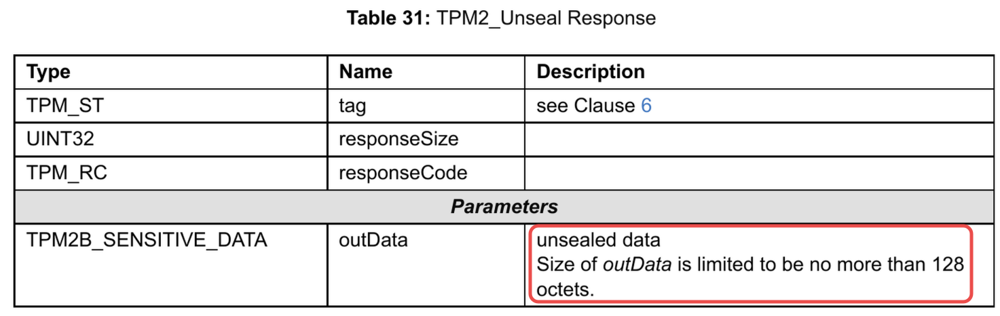
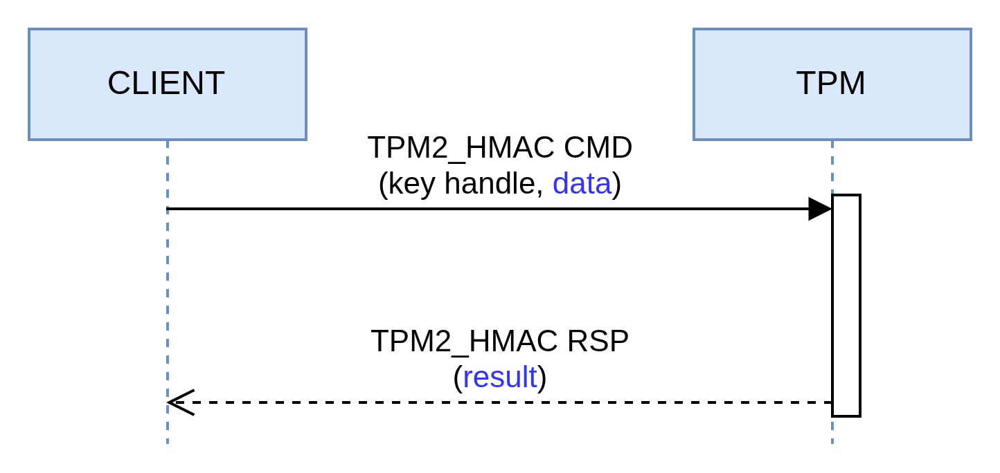

# Perform cryptographic operations with symmetric keys

After introducing asymmetric keys in the previous pill, it's time to move on to symmetric keys.

Like asymmetric keys, symmetric keys can be used to perform encryption/decryption or signature operations. These two types of operations allow us to address a number of use cases, the most well-known being probably the encryption function that enables Bitlocker (on Windows) and systemd (on Linux) to work.

<div class="info">
<strong>How do these systems work?</strong>

During an onboarding phase, a secret (aka symmetric key) is produced to encrypt and decrypt the disk with a good security/speed ratio. However, a question remains: how to securely store this secret at rest? The TPM is the component (co-located on the machine) that carries this responsibility. Subsequently, during the early boot, the encrypted (sealed) secret is provided to the TPM which returns the plaintext value.
</div>

Now, let's take a closer look at how things work through a series of small examples!

<div class="info">
<strong>Info</strong>

The code of the CLI that you will see below is fully available <a href="https://github.com/loicsikidi/tpm-pills/tree/main/examples/06-pill" target="_blank">here</a>.

Note: if you want to use a real TPM in the examples, you can add <code class="hljs">--use-real-tpm</code> flag in each command.
</div>

## Encryption / Decryption vs. Seal / Unseal

It is necessary to distinguish between *encryption* and *sealing*. In one case we will use a key to perform cryptographic operations (e.g. <code class="hljs">AES</code> or <code class="hljs">SM4</code>), in the other we will want to protect a secret generally produced outside the TPM.

### Encryption / Decryption

<div class="warning">
<strong>Warning</strong>

Most TPMs do not support symmetric encryption as indicated in the spec below:


For example, my machine's TPM does not support this function.

If you are on Linux, you can check support by running the following command:

<pre><code class="hljs">tpm2_getcap commands | grep -i encryptdecrypt</code></pre>
</div>

Let's start by creating a symmetric key with the following characteristics:


| sign | decrypt | restricted |
| :--: | :-----: | :--------: |
|  0   |    1    |      0     |
<p align="center"><b>Table: </b><em>Key attributes</em></p>


```go
# Note: the key will be stored in the current directory
# with the name `key.tpm`
go run github.com/loicsikidi/tpm-pills/examples/06-pill create
# output: Ordinary key created successfully 🚀
```

<div class="info">
<strong>Info</strong>

The key is AES 128-bit type and the encryption mode is <code class="hljs">CFB</code> (Cipher Feedback).

<em>Why this mode?</em>

Although far from current standards (e.g. lack of data authentication), it benefits from wide support.
</div>

Now, we can perform encryption / decryption:

```go
go run github.com/loicsikidi/tpm-pills/examples/06-pill encrypt --message "Hello TPM Pills!" --output ./blob.enc
# output: Encrypted message saved to ./blob.enc 🚀

go run github.com/loicsikidi/tpm-pills/examples/06-pill decrypt --key ./key.tpm \
--in ./blob.enc
# output: Decrypted "Hello TPM Pills!" successfully 🚀

# clean up
go run github.com/loicsikidi/tpm-pills/examples/06-pill cleanup
rm -f ./key.tpm ./blob.enc
```

Under the hood, the CLI uses the <code class="hljs">TPM2_EncryptDecrypt2</code> command (which is the successor of <code class="hljs">TPM2_EncryptDecrypt</code> as it adds a security element[^1])

```go
rsp, _ := tpm2.EncryptDecrypt2{
	KeyHandle: keyHandle, // reference to the key doing the job

	// if the payload is bigger than TPM's buffer
	// we can use pagination ⬇️
	Message: tpm2.TPM2BMaxBuffer{
		Buffer: block,
	},
	Mode:    mode, // eg. CFB, GCM, etc.
	Decrypt: decrypt, // this is a boolean
	IV: tpm2.TPM2BIV{
		Buffer: iv,
	},
}.Execute(tpm)
```

### Seal / Unseal

Since support for <code class="hljs">TPM2_EncryptDecrypt</code> and <code class="hljs">TPM2_EncryptDecrypt2</code> is not widespread, you will mostly use sealing to encrypt secrets at rest.

$IMAGE

To do this, you have two steps:
1. the seal: <code class="hljs">TPM2_CreatePrimary</code> or <code class="hljs">TPM2_Create</code>
2. the unseal: <code class="hljs">TPM2_Unseal</code>

<div class="info">
<strong>Info</strong>

In the implementations I've most often seen  <code class="hljs">TPM2_Create</code> command used for sealing under a <em>Storage Key</em>[^2].
</div>

Data to seal is **nothing more and nothing less** than a key with the following properties:

| sign | decrypt | restricted |
| :--: | :-----: | :--------: |
|  0   |    0    |      0     |
<p align="center"><b>Table: </b><em>Sealed data key attributes</em></p>

In short, a key that technically can do nothing except return its content via the <code class="hljs">TPM2_Unseal</code> command.

Let's see what it looks like in code:

```go
# SEAL
createRsp, _ := tpm2.Create{
    ParentHandle: parentHandle,
    InPublic: tpm2.New2B(tpm2.TPMTPublic{
		Type:    tpm2.TPMAlgKeyedHash, // indicates that it's a shared secret
		NameAlg: tpm2.TPMAlgSHA256,
		ObjectAttributes: tpm2.TPMAObject{
			FixedTPM:            true,
			FixedParent:         true,
			UserWithAuth:        true,
			SensitiveDataOrigin: false,  // necessary because the value has been generated outside the TPM
			SignEncrypt:         false,
			Decrypt:             false,
			Restricted:          false,
		},
	}),
	InSensitive: TPM2BSensitiveCreate{
		Sensitive: &TPMSSensitiveCreate{
			Data: NewTPMUSensitiveCreate(&TPM2BSensitiveData{
				Buffer: []byte("VALUE TO SEAL"), // data blob
			}),
		},
	},
}.Execute(tpm)

# UNSEAL
unsealRsp, _ := tpm2.Unseal{
	ItemHandle: keyHandle, // key to unseal's handle
}.Execute(thetpm)
```

As we can see above, the *seal* consists of creating a symmetric key by providing it with the value. The TPM via the Primary Seed (i.e. <code class="hljs">TPM2_CreatePrimary</code>) or the Storage Parent (i.e. <code class="hljs">TPM2_Create</code>) is able to encrypt the key's content to store it securely.

<div class="info">
<strong>Info</strong>

The spec limits the secret size to <strong>128 bytes</strong> so keep that in mind!


</div>

Please find below a concrete example using the CLI:

```bash
go run github.com/loicsikidi/tpm-pills/examples/06-pill seal \
--message "important secret" --output ./sealed_key.tpm
# output: Sealed message saved to ./sealed_key.tpm 🚀

go run github.com/loicsikidi/tpm-pills/examples/06-pill unseal --in ./sealed_key.tpm
# output: Unsealed message: "important secret" 🚀

# clean up
go run github.com/loicsikidi/tpm-pills/examples/06-pill cleanup
rm -f ./sealed_key.tpm
```

## Signature

Here, <code class="hljs">HMAC</code>[^3] is used to sign messages, most often for authentication purposes. For example, the S3 authentication protocol relies on this principle (i.e. <a href="https://docs.aws.amazon.com/AmazonS3/latest/API/sigv4-auth-using-authorization-header.html" target="_blank">AWS Signature v4</a>) by sharing a *shared secret* with the client.

<div class="warning">
<strong>Warning</strong>

Whenever possible, try to base authentication on ephemeral identities through <strong>Identity Federation</strong>[^4] rather than long-term secrets even when stored in a TPM.
</div>

For this use case, this pill will not provide an example, however, here are two repos that show how to implement this in Go:
* <a href="https://github.com/salrashid123/aws_hmac" target="_blank">aws_hmac</a>
* <a href="https://github.com/salrashid123/gcs_tpm" target="_blank">gcs_tpm</a>

### Deep dive: derives key (KDF)

In addition to signing, the <code class="hljs">HMAC</code> function provides a quite interesting property, that of being able to derive other symmetric keys from a master key.


The idea is quite elegant in that:
* the master key is stored in a secure environment (i.e. TPM)
* the TPM is autonomous to generate the HMAC

The HMAC plays the role of *Pseudorandom Function (PRF)* to produce a <code class="hljs">seed</code> that will be used by a *Key Derivation Function (KDF)* to generate a key with good entropy.

<div class="info">
<strong>What is a PRF?</strong>

It's a deterministic function that:
<ol>
  <li><strong>Takes two inputs</strong>:
    <ul>
      <li>A <strong>secret key</strong> K (master key)</li>
      <li>Some <strong>arbitrary data</strong> M (message/data)</li>
    </ul>
  </li>
  <li><strong>Produces an output</strong>:
    <ul>
      <li>A <strong>pseudorandom</strong> output of fixed length</li>
      <li>Indistinguishable from a truly random function for an attacker who doesn't know K</li>
    </ul>
  </li>
  <li><strong>Essential properties</strong>:
    <ul>
      <li><strong>Deterministic</strong>: PRF(K, M) always produces the same result</li>
      <li><strong>Pseudorandom</strong>: Without knowing K, the output appears random</li>
      <li><strong>One-way</strong>: Impossible to recover K or M from the output</li>
      <li><strong>Collision resistant</strong>: Difficult to find M₁ ≠ M₂ such that PRF(K,M₁) = PRF(K,M₂)</li>
    </ul>
  </li>
</ol>
</div>

Here's how this applies in a TPM context:
* `K`: is an HMAC type key that is loaded in the TPM (*key handle* in the diagram below)    
* `M`: is the data to be signed (*data* in the diagram below)



The example below shows how to generate an HMAC with a *digest* produced with <code class="hljs">SHA-256</code>:

```bash
go run github.com/loicsikidi/tpm-pills/examples/06-pill hmac --data "secret"
# output: HMAC result: "bde701bc281f6d5e55ee29b30c08c59fb05425298442b5060238af88305964a0" 🚀

# value is deterministic
go run github.com/loicsikidi/tpm-pills/examples/06-pill hmac --data "secret"
# output: HMAC result: "bde701bc281f6d5e55ee29b30c08c59fb05425298442b5060238af88305964a0" 🚀

# cleanup
go run github.com/loicsikidi/tpm-pills/examples/06-pill cleanup
```

> *Note: the output is formatted in hexadecimal for clarity but this doubles the payload size. Originally it is 32 bytes, in hex it is therefore 64 bytes.*

The key that was produced has the following characteristics this time:

| sign | decrypt | restricted |
| :--: | :-----: | :--------: |
|  1   |    0    |      0     |
<p align="center"><b>Table: </b><em>HMAC key attributes</em></p>

Since HMAC is a signature protocol, this is indeed a prerequisite.

The size of the *seed* varies depending on the *hash* function.

| Hash Algo | HMAC Length (in bytes) |
| :------: | :-------------------------: |
|  <code class="hljs">SHA-256</code>  |    32    |
|  <code class="hljs">SHA-384</code>  |    48    |
|  <code class="hljs">SHA-512</code>  |    64    |
<p align="center"><b>Table: </b><em>HMAC length by hash algorithm</em></p>


<div class="info">
<strong>Go further</strong>

If you're interested in the subject, I recommend taking a look at the <a href="https://github.com/salrashid123/tpm-kdf" target="_blank">tpm-kdf</a> repo which provides a KDF implementation based on <em>Counter Mode</em>. In parallel, I also recommend reading <a href="https://csrc.nist.gov/pubs/sp/800/108/r1/upd1/final" target="_blank">NIST SP 800-108</a> for all the security information.
</div>

## Acknowledgement

You probably noticed that this pill mentions several repos belonging to <a href="https://github.com/salrashid123" target="_blank">salrashid123</a> who is a person whose contributions on TPM usage are invaluable.

Shout-out to him!

## Bonus

The file <a href="https://github.com/loicsikidi/tpm-pills/tree/main/examples/06-pill/concepts_test.go" target="_blank">06-pill/concepts_test.go</a> includes unit tests demonstrating some concepts that were discussed in this pill (e.g. maximum seal size, HMAC sizes, etc.)

## Conclusion

In this pill, we introduced different use cases for symmetric keys. The key takeaways are as follows:
* support for symmetric encryption is very limited
* seal/unseal turns out to be the alternative
* HMAC is the first-class citizen algorithm for signing

Nevertheless, some might say "that's nice and all, but where is the authorization layer?". A little patience, this topic will be addressed as soon as the main concepts are mastered, but know that it is possible to set up more or less complex locks. For example, it is possible to:
* ask the user to provide a passphrase to authorize unsealing
* limit the unseal operation only during boot (not after in user-space)
* authorize unsealing if and only if the machine is in a trusted state at boot time (cf. *measured boot*)

## Next Pill...

...we will focus on the two elements that allow referencing a key (the *handle* and the *name*) in a TPM.

---

🚧 `TPM Pills` is in **beta** 🚧

* if you encounter problems 🙏 please report them on the <a href="https://github.com/loicsikidi/tpm-pills/issues" target="_blank">tpm-pills</a> issue tracker
* if you think that `TPM Pills` should cover a specific topic which isn't in the <a href="https://github.com/loicsikidi/tpm-pills/blob/main/ROADMAP.md" target="_blank">roadmap</a>, let's initiate a <a href="https://github.com/loicsikidi/tpm-pills/discussions/new?category=ideas" target="_blank">discussion</a>

[^1]: <code class="hljs">TPM2_EncryptDecrypt2</code> adds the ability to encrypt in transit the content of the data to be encrypted or decrypted.
[^2]: concept defined in <a href="https://tpmpills.com/04-create-a-tpm-key.html#creating-the-primary-key" target="_blank">pill #4</a>
[^3]: see the <a href="https://en.wikipedia.org/wiki/HMAC" target="_blank">Wikipedia page</a>
[^4]: I'm referring in particular to <code class="hljs">GCP Workload Identity</code>, <code class="hljs">AWS STS</code> or <code class="hljs">AD federated identity credentials</code>
