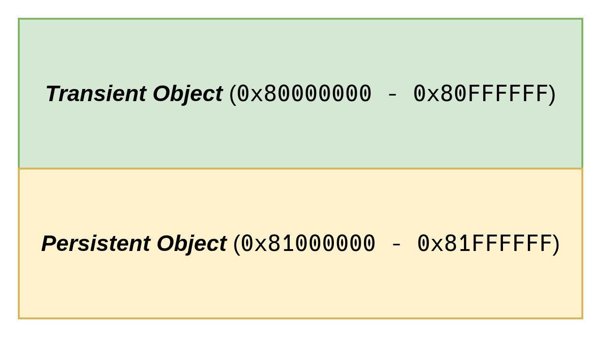
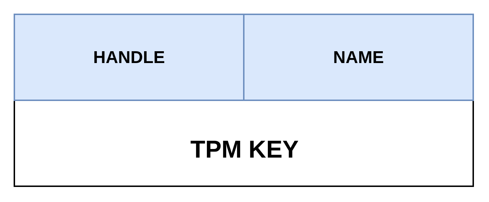
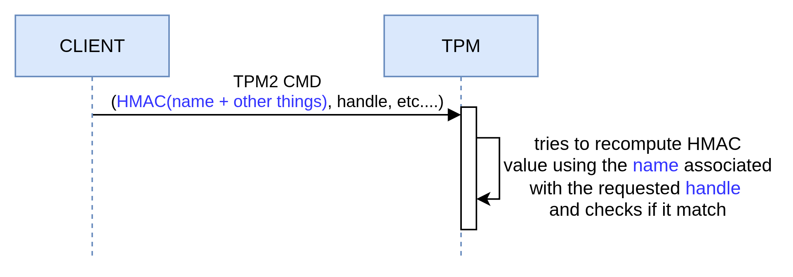

# Name and Handle: a way to identify a key

Now that we have a good understanding of the different key types and their usage, let's focus on the concepts of *name* and *handle*.

## Name

Let's start by discussing the **name**. Simply put, the *name* is a key's unique identifier (its *fingerprint*). The spec states that the *name* is the result of the following function: \\( name = nameAlg || Hash(nameAlg, publicArea) \\).

In short, it is nothing more than the concatenation of a prefix (the hash algorithm that was used) and a hash.

<div class="info">

**What is the `publicArea`[^1]?**

It is a payload carrying public metadata about a key stored in a TPM (i.e. *TPMT_PUBLIC*). It is important to note that both symmetric and asymmetric keys have a `publicArea`.
</div>

Please find below the different fields associated with the publicArea:

| Parameter | Description |
| --------- | ----------- |
| type | algorithm associated with the key (e.g. RSA, ECC, etc.) |
| nameAlg | algorithm used for computing the Name of the object (e.g. SHA256, etc.) |
| objectAttributes | attributes that, along with type, determine the manipulations of this object |
| authPolicy | optional policy for using this key |
| parameters | the algorithm or structure details |
| unique | the unique identifier of the structure. For an asymmetric key, this would be the public key |
<p align="center"><b>Table: </b><em>publicArea fields</em></p>

<p align="center">Source: <a href="https://trustedcomputinggroup.org/wp-content/uploads/Trusted-Platform-Module-2.0-Library-Part-2-Version-184_pub.pdf#page=186" target="_blank">section 12.2.4, Part 2, v184 TPM 2.0</a></p>.

The important thing here is not to understand the purpose of each field but rather to keep in mind:

1. that these fields are expected when creating a key
2. that once created, these fields are no longer modifiable

*Is the name predictable?*

Not really, because when the TPM generates the private key, the client cannot know its value in advance. The client relies entirely on the TPM, and it is no surprise that the `TPM2_CreatePrimary` and `TPM2_Create` commands return the key's name in their response.

<div class="info">
<strong>Use case</strong>

Typically, the <em>name</em> is the ideal data to store in an inventory to identify a key because it is a static value.
</div>

## Handle

Now, let's discuss the notion of *handle*. A TPM can be seen as a *heap* [^2] into which objects are loaded for interaction. As such, each key is associated with a memory area called a **handle**.

<div class="info">
<strong>Info</strong>

The TPM is capable of loading other types of resources but this is of little importance for now. If the topic interests you, TCG defines the addressing of objects based on their type in <a href="https://trustedcomputinggroup.org/resource/registry/" target="_blank">this document</a>.
</div>

When created, a key is necessarily associated with a *transient handle*, meaning an *ephemeral* memory area. Indeed, if the machine reboots, the object will no longer be accessible. In practice, this is not a problem because, just like in the examples from previous pills, we can store the key on disk (i.e. TPM2B_PUBLIC/PRIVATE) and reload it later via the `TPM2_Load` command.

The TCG spec nevertheless provides an alternative, through another memory area called *persistent handle*. As its name suggests, this part of the TPM persists keys [^3] (despite reboots) and is relevant when you want to avoid storing a key outside the TPM.

Please find below a representation of the two handle families:



> *Note: The diagram shows the address range*.

*How does it work?*

As mentioned in the preamble, a key that is created (i.e. `TPM2_Create` or `TPM2_CreatePrimary`) or loaded (i.e. `TPM2_Load`) into a TPM is necessarily associated with a *transient handle*. The `TPM2_EvictControl` [^4] command allows persisting a key.

<div class="info">
<strong>Info</strong>

`TPM2_EvictControl` also allows removing an already persisted object, if you need to get rid of it.
</div>

Once persisted, you must use the `TPM2_ReadPublic`[^5] command instead of `TPM2_Load` to load a key into the TPM in order to use it.

> *Note: both a primary key and an ordinary key (see <a href="https://tpmpills.com/04-create-a-tpm-key.html#key-hierarchy" target="_blank">pill#4</a> for a definition) can be persisted.*

## Deep dive: Name + Handle = extra protection

Now, let's spend some time looking at how the TPM uses these two concepts to improve security.

A key can be reduced to the diagram below:


1. a memory address (i.e. handle)
2. a unique identifier (i.e. name)

To secure communication on the bus, the TPM allows setting up a session between the client (e.g. TPM library) and the TPM. This session enables, among other things, an integrity mechanism based on signatures. Indeed, it is possible to add a signature to a command and to a response so that the entity receiving the *payload* can verify its integrity and ensure that the data has not been altered during transit.

To do so, the command or response includes an HMAC (i.e. signature) that represents the object in transit. In the case of a command involving one or more keys, the *name* is an element of the signature. When the TPM receives the command, it loads the keys from the specified handles and computes the *name* to reproduce the HMAC. If the HMAC is verified, we have assurance of the authenticity of the name/handle pair binding and that we are not victims of a substitution attack.

The diagram below visually expresses what has just been discussed:



## A practical example

Now that we've covered the main ideas, let's get hands-on!

<div class="warning">
<strong>Objective</strong>

<ol>
  <li>Persist a key</li>
  <li>Load a persisted key</li>
</ol>
</div>

### Persist a Key

As discussed in the previous section, to persist a key, you need to use the `TPM2_EvictControl` command:

```go
evictControlCmd := tpm2.EvictControl{
	Auth: tpm2.TPMRHOwner, // indicates the hierarchy (may require authentication)
	ObjectHandle: &tpm2.NamedHandle{ // reference to the key to persist
		Handle: createKeyRsp.ObjectHandle,
		Name:   createKeyRsp.Name,
	},
	PersistentHandle: 0x81000010, // location where the key will be stored
}
evictControlRsp, _ := evictControlCmd.Execute(tpm)
```

<div class="info">
<strong>Reminder</strong>

To remove the key, you need to replay the `TPM2_EvictControl` command (I know, it's counter-intuitive).
</div>

### Load a Persisted Key

Then, the `TPM2_ReadPublic` command allows loading the key using its handle so it can be used:

```go
readPubCmd := tpm2.ReadPublic{
	ObjectHandle: tpm2.TPMHandle(0x81000010), // location where the key is stored
}
readPubRsp, _ := readPubCmd.Execute(tpm)
```

## Complete Example

To make this more concrete, this pill includes a working example that implements everything we've discussed so far.

<div class="info">
<strong>Info</strong>

The source code is available <a href="https://github.com/loicsikidi/tpm-pills/tree/main/examples/07-pill" target="_blank">here</a>.

Note: if you want to use a real TPM in the examples, you can add `--use-real-tpm` flag in each command (*except* `cleanup`).
</div>


```bash
# Create an ECC key, persist it at the given handle
# and write its public key (in PEM format) to the filesystem
go run github.com/loicsikidi/tpm-pills/examples/07-pill persist --handle 0x81000010
# output:
# Key persisted at handle 0x81000010
# Public key saved to /path/to/public.pem 🚀


# Load the key at the given handle and check if it matches the public key stored
# on the filesystem
go run github.com/loicsikidi/tpm-pills/examples/07-pill read --handle 0x81000010 \
--pubkey public.pem
# output: Persisted key at handle 0x81000010 matches the provided public key ✅

# Remove the key from the persisted handle
go run github.com/loicsikidi/tpm-pills/examples/07-pill unpersist --handle 0x81000010
# output: Key at handle 0x81000010 has been removed

# Ensure that the key has been removed as expected
go run github.com/loicsikidi/tpm-pills/examples/07-pill read --pubkey public.pem \
--handle 0x81000010
# output:
# error reading persisted key: failed to get persisted key handle: handle not
# found at address 0x81000010: TPM_RC_HANDLE (handle 1): the handle is not
# correct for the use

# Clean up
# Note: the command will remove swtpm state
go run github.com/loicsikidi/tpm-pills/examples/07-pill cleanup
# output: State cleaned successfully 🚀

# remove created file
rm -f ./public.pem
```

## Bonus

The file <a href="https://github.com/loicsikidi/tpm-pills/tree/main/examples/07-pill/concepts_test.go" target="_blank">07-pill/concepts_test.go</a> includes unit tests demonstrating some concepts that were discussed in this pill (e.g. name computation, session signature, create & createPrimary produce a key bound to a transient handle).

## Conclusion

In this pill, we introduced the concept of ***handle***, which allowed us to see that the TPM provides two memory areas, the first volatile and the second persistent. Furthermore, we saw that the ***name*** is a key's *fingerprint* and that, as such, this information is used internally by the TPM to secure exchanges (i.e. signature) or externally by an application to get a unique identifier for the key.

## Next Pill...

...we will focus on ***4 types of keys*** that you MUST know about in order to effectively use a TPM.

---

🚧 `TPM Pills` is in **beta** 🚧

* if you encounter problems 🙏 please report them on the <a href="https://github.com/loicsikidi/tpm-pills/issues" target="_blank">tpm-pills</a> issue tracker
* if you think that `TPM Pills` should cover a specific topic which isn't in the <a href="https://github.com/loicsikidi/tpm-pills/blob/main/ROADMAP.md" target="_blank">roadmap</a>, let's initiate a <a href="https://github.com/loicsikidi/tpm-pills/discussions/new?category=ideas" target="_blank">discussion</a> 💬

[^1]: <a href="https://trustedcomputinggroup.org/wp-content/uploads/Trusted-Platform-Module-2.0-Library-Part-2-Version-184_pub.pdf#page=186" target="_blank">https://trustedcomputinggroup.org/wp-content/uploads/Trusted-Platform-Module-2.0-Library-Part-2-Version-184_pub.pdf#page=186</a>
[^2]: memory area
[^3]: and other types of objects
[^4]: <a href="https://trustedcomputinggroup.org/wp-content/uploads/Trusted-Platform-Module-2.0-Library-Part-3-Version-184_pub.pdf#page=299" target="_blank">https://trustedcomputinggroup.org/wp-content/uploads/Trusted-Platform-Module-2.0-Library-Part-3-Version-184_pub.pdf#page=299</a>
[^5]: <a href="https://trustedcomputinggroup.org/wp-content/uploads/Trusted-Platform-Module-2.0-Library-Part-3-Version-184_pub.pdf#page=74" target="_blank">https://trustedcomputinggroup.org/wp-content/uploads/Trusted-Platform-Module-2.0-Library-Part-3-Version-184_pub.pdf#page=74</a>
